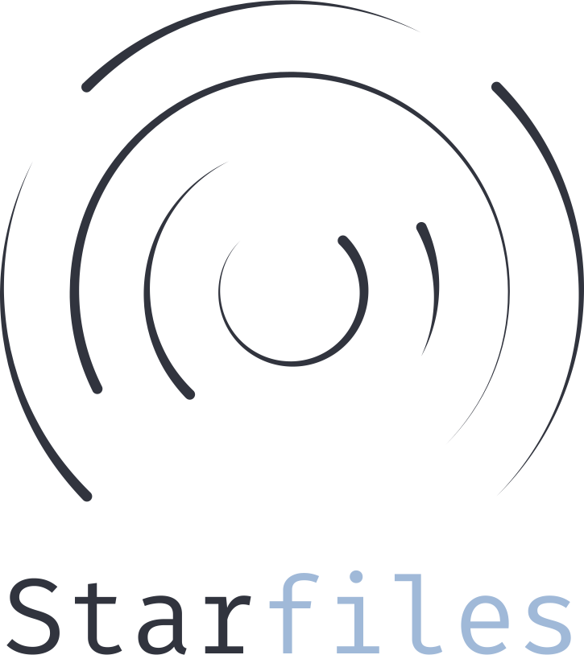
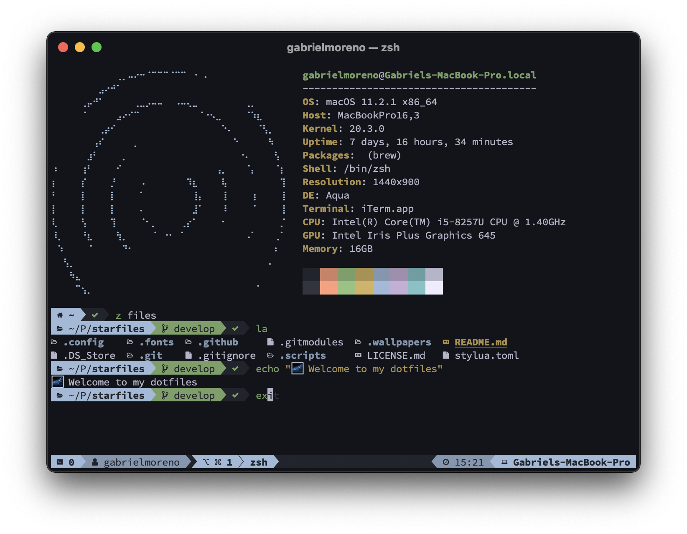
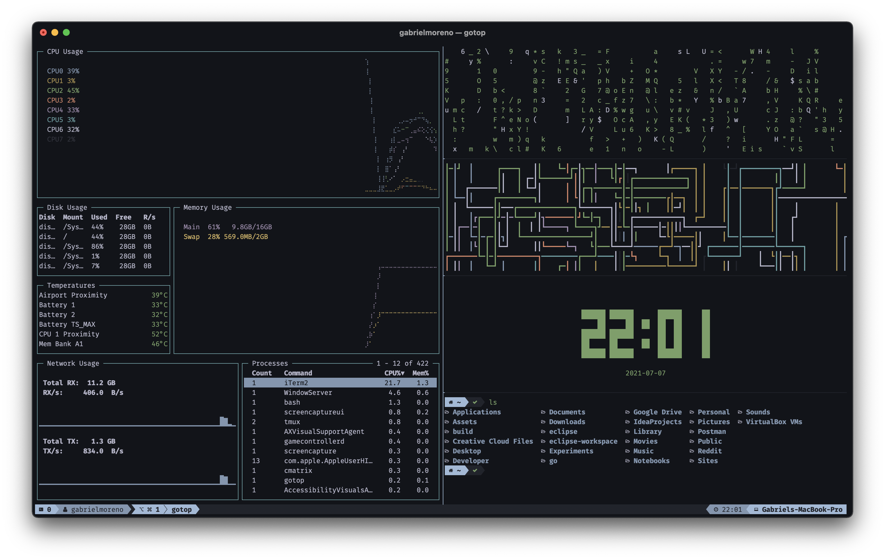
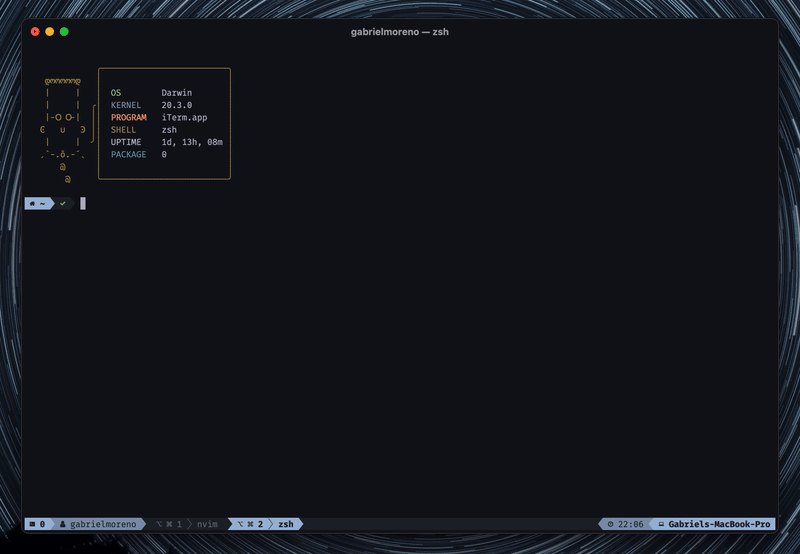

  

  
  
  
  
  

<h1 align="center">A setup from the stars</h1>

  

> The nitrogen in our DNA, the calcium in our teeth, the iron in our blood, the carbon in our apple pies were made in the interiors of collapsing stars. We are made of starstuff.
>
> \- Carl Sagan

The power of the command line is often underrated. My developer journey led me to an almost 100% terminal-based way of working (and living), for this reason, I organized all my config files in this dotfiles repo, in order to keep track of my settings, programs, themes & more. Feel free to use whatever you want!

**NOTE:** This is a macOS-based setup in terms of paths & package managers, keep this in mind before trying to directly clone & setup all my configurations.

## Tools

As a command-line user, all of my tools are terminal-based, therefore I can group all of them in 3 major categories:

- My **terminal emulator**.
- My **editor**.
- My **utilities**.

### Terminal emulator

For my terminal emulator, I use [iTerm2](https://iterm2.com/), the macOS terminal replacement, alongside with [TMUX](http://www.sromero.org/wiki/linux/aplicaciones/tmux), a terminal multiplexer, in order to handle panes, splits, tabs, and sessions.

  

I also use [Zsh](https://www.zsh.org/) as my main interactive shell, loading the [Agnoster](https://github.com/agnoster/agnoster-zsh-theme) theme, and plugins such as:

- [`zsh-z`](https://github.com/agkozak/zsh-z) - Jump quickly to directories that you have visited "frecently".
- [`zsh-autosuggestions`](https://github.com/zsh-users/zsh-autosuggestions) - Fish-like autosuggestions for Zsh.
- [`zsh-syntax-highlighting`](https://github.com/zsh-users/zsh-syntax-highlighting) - Fish shell like syntax highlighting for Zsh.

### Editor

I use [Neovim](https://neovim.io/) as my main text-editor for everything, from scripting to web development to mobile applications and even machine learning & data science. My config files use [Lua](https://www.lua.org/) instead of VimScript to take advantage of all the native toosl such as LSP's and syntax trees.

  

My setup uses the following:

- [`packer.nvim`](https://github.com/wbthomason/packer.nvim) - A use-package inspired plugin manager for Neovim. Uses native packages, supports Luarocks dependencies, written in Lua, allows for expressive config.
  - [`vim-startrail`](https://github.com/gantoreno/vim-startrail) - A dark & peaceful colorscheme for Vim & Neovim.
  - [`nvim-dashboard`](https://github.com/glepnir/dashboard-nvim) - A Vim dashboard.
  - [`nvim-lspconfig`](https://github.com/neovim/nvim-lspconfig) - Quickstart configurations for the Nvim LSP client.
  - [`nvim-treesitter`](https://github.com/nvim-treesitter/nvim-treesitter) - Nvim TreeSitter configurations and abstraction layer.
  - [`vim-airline`](https://github.com/vim-airline/vim-airline) - Lean & mean status/tabline for Vim that's light as air.
  - [`telescope.nvim`](https://github.com/nvim-telescope/telescope.nvim) - Find, Filter, Preview, Pick. All lua, all the time.
  - [`nvim-tree.lua`](https://github.com/kyazdani42/nvim-tree.lua) - A file explorer tree for neovim written in Lua.
  - [`vim-signify`](https://github.com/mhinz/vim-signify) - Show a diff using Vim its sign column.
  - [`indent-blankline.nvim`](https://github.com/lukas-reineke/indent-blankline.nvim) - Indent guides for Neovim.

Note how TMUX also helps on creating extra terminal panes to perform command-line tasks alongside the main editing window, this is achieved using a custom script called `workspace` (see the `.scripts` directory).

### Utilities

Editing is not the only thing to do when it comes to terminals, this are the set of utilities I use on a daily basis to perform tasks regarding version control, project management, connectivity & more:

- [`git`](https://git-scm.com/) - Git is a free and open source distributed version control system designed to handle everything from small to very large projects with speed and efficiency.
- [`fnm`](https://github.com/Schniz/fnm#shell-setup) - Fast and simple Node.js version manager, built in Rust.
  - [`node`](https://nodejs.org/es/) - Node.js is a JavaScript runtime built on Chrome's V8 JavaScript engine.
  - [`npm`](https://www.npmjs.com/) - The free NPM registry has become the center of JavaScript code sharing, and with more than one million packages, the largest software registry in the world.
- [`brew`](https://brew.sh/index_es) - Homebrew is the easiest and most flexible way to install the UNIX tools Apple didn’t include with macOS.
- [`exa`](https://github.com/ogham/exa) - A modern replacement for `ls`.
- [`macfetch`](https://github.com/gantoreno/macfetch) - A macOS Neofetch alternative written in C++.
- [`curl`](https://curl.se/) - command line tool and library for transferring data with URLs.
- [`wget`](https://www.gnu.org/software/wget/) - GNU Wget is a free software package for retrieving files using HTTP, HTTPS, FTP and FTPS, the most widely used Internet protocols.
- [`ngrok`](https://ngrok.com/) - Ngrok provides a real-time web UI where you can introspect all HTTP traffic running over your tunnels.
- [`openssh`](https://www.openssh.com/) - OpenSSH is the premier connectivity tool for remote login with the SSH protocol.
- [`openssl`](https://www.openssl.org/) - OpenSSL is a robust, commercial-grade, and full-featured toolkit for the Transport Layer Security (TLS) and Secure Sockets Layer (SSL) protocols.

## Fonts

My setup currently uses Mozilla's original [Fira Mono](https://github.com/mozilla/Fira) (specifically the [NF patched version](https://github.com/mozilla/Fira)). It preserves a decent line height that is comfortable to the eyes and a good aspect ratio for my coding preferences. All my fonts can be found inside the `.fonts` directory.

## Wallpapers

These are some of the most common wallpapers you'll see me using with this setup:

| Name      | Wallpaper                                           |
| --------- | --------------------------------------------------- |
| Startrail |  |

## Inspiration

All my doftfiles have some bit of inspiration on other repos I've encountered throughout my days, you should definitely check out the following:

- Kutsan Kaplan's [dotfiles](https://github.com/kutsan/dotfiles).
- Lukas Reineke's [config files](https://github.com/lukas-reineke/dotfiles).
- Luke Smith's [void rice](https://github.com/LukeSmithxyz).
- Christian Chiarulli's [LunarVim](https://github.com/ChristianChiarulli/LunarVim).
- Takuya Matsuyama's [public dotfiles](https://github.com/craftzdog/dotfiles-public).

## License

Licensed under the [GNU GPLv3](https://www.gnu.org/licenses/gpl-3.0.html) license.
