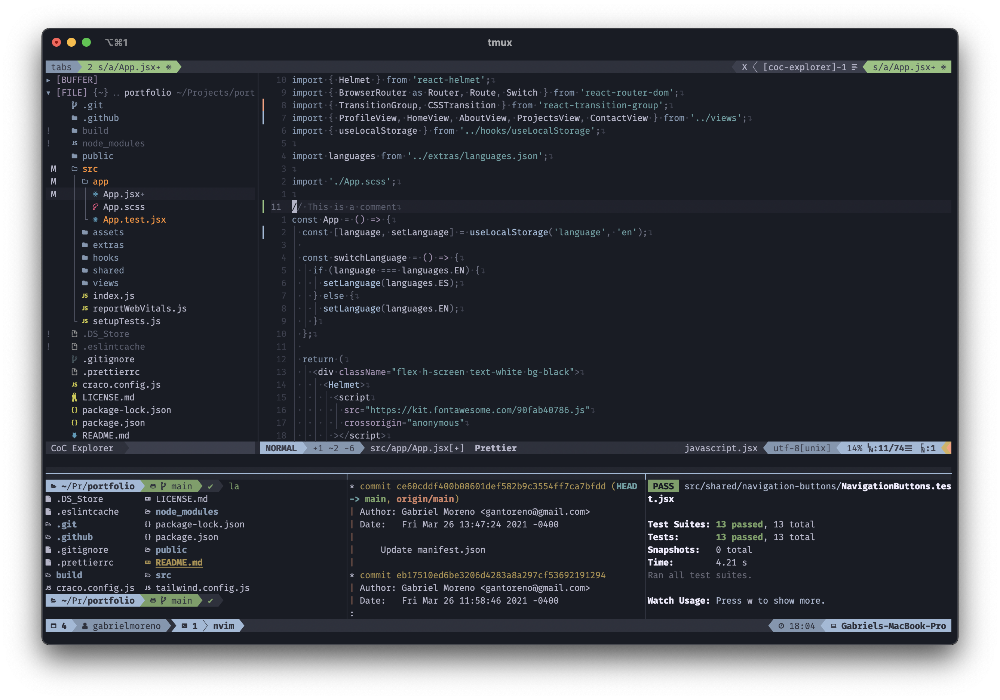

  </img>

# My Dotfiles

Config files for my terminal utilities.

## Tools

I use [Neovim](https://neovim.io/) as my main editor, along with [VimPlug](https://github.com/junegunn/vim-plug) to manage VIM plugins. I also use the [TMUX](https://github.com/tmux/tmux/wiki) terminal multiplexer for session management.
