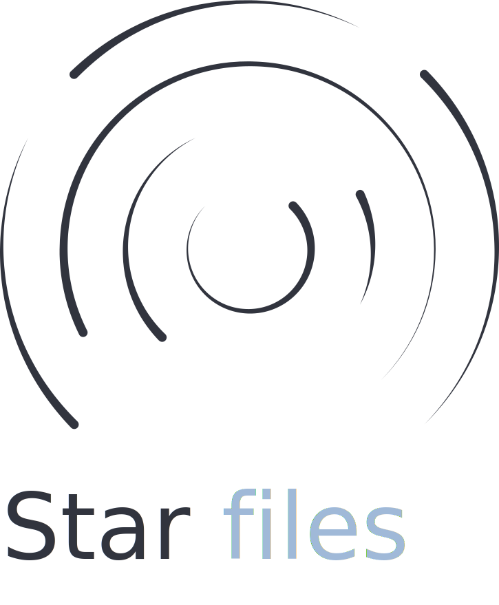

  

  
  
  
  
  

> Being in command means making tough decisions. Not being in command means shutting up and doing what you're told.
>
> \- Eoin Colfer, The Artemis Fowl Files.

The power of the command line is often underrated. My developer journey led me to an almost 100% terminal-based way of working (and living), for this reason, I organized all my config files in this dotfiles repo, in order to keep track of my settings, programs, themes & more. Feel free to use whatever you want!

**NOTE:** This is a macOS-based setup in terms of paths & package managers, keep this in mind before trying to directly clone & setup all my configurations.

## Tools

My everyday tools consist of the following:

- [`iterm2`](https://iterm2.com/) - The macOS Terminal Replacement.
- [`zsh`](https://www.zsh.org/) - Zsh is a shell designed for interactive use.
  - [`agnoster`](https://github.com/agnoster/agnoster-zsh-theme) - A Zsh theme designed to disclose information contextually, with a powerline aesthetic.
  - [`zsh-z`](https://github.com/agkozak/zsh-z) - Jump quickly to directories that you have visited "frecently".
  - [`zsh-autosuggestions`](https://github.com/zsh-users/zsh-autosuggestions) - Fish-like autosuggestions for Zsh.
  - [`zsh-syntax-highlighting`](https://github.com/zsh-users/zsh-syntax-highlighting) - Fish shell like syntax highlighting for Zsh.
- [`nvim`](https://neovim.io/) - Drop-in Vim. Fully compatible with Vim's editing model and the Vimscript language.
  - [`vim-plug`](https://github.com/junegunn/vim-plug) - Minimalist Vim Plugin Manager.
    - [`vim-startrail`](https://github.com/gantoreno/vim-startrail) - A dark & peaceful colorscheme for Vim & Neovim.
    - [`vim-airline`](https://github.com/vim-airline/vim-airline) - Lean & mean status/tabline for Vim that's light as air.
    - [`nvim-lspconfig`](https://github.com/neovim/nvim-lspconfig) - Quickstart configurations for the Nvim LSP client.
    - [`nvim-treesitter`](https://github.com/nvim-treesitter/nvim-treesitter) - Nvim Treesitter configurations and abstraction layer.
    - [`telescope.nvim`](https://github.com/nvim-telescope/telescope.nvim) - Find, Filter, Preview, Pick. All lua, all the time.
    - [`vim-devicons`](https://github.com/ryanoasis/vim-devicons) - Adds file type icons to Vim plugins such as: NERDTree, vim-airline, CtrlP, unite, Denite, lightline, vim-startify and many more.
    - [`emmet-vim`](https://github.com/mattn/emmet-vim) - A Vim plug-in which provides support for expanding abbreviations similar to emmet.
    - [`vim-signify`](https://github.com/mhinz/vim-signify) - Show a diff using Vim its sign column.
    - [`indent-blankline.nvim`](https://github.com/lukas-reineke/indent-blankline.nvim) - Indent guides for Neovim.
- [`tmux`](http://www.sromero.org/wiki/linux/aplicaciones/tmux) - TMUX is a terminal multiplexer.
- [`git`](https://git-scm.com/) - Git is a free and open source distributed version control system designed to handle everything from small to very large projects with speed and efficiency.
- [`nvm`](https://github.com/nvm-sh/nvm) - NVM is a version manager for Node.js, designed to be installed per-user, and invoked per-shell.
  - [`node`](https://nodejs.org/es/) - Node.js is a JavaScript runtime built on Chrome's V8 JavaScript engine.
  - [`npm`](https://www.npmjs.com/) - The free NPM registry has become the center of JavaScript code sharing, and with more than one million packages, the largest software registry in the world.
    - [`taskbook`](https://github.com/klaussinani/taskbook) - Tasks, boards & notes for the command-line habitat.
    - [`prettier`](https://prettier.io/) - An opinionated code formatter.
    - [`emmet`](https://emmet.io/) - Emmet is a set of plug-ins for text editors that allow for high-speed coding and editing in HTML, XML, XSLT, and other structured code formats via content assist.
    - [`eslint`](https://eslint.org/) - ESLint is a static code analysis tool for identifying problematic patterns found in JavaScript code.
- [`brew`](https://brew.sh/index_es) - Homebrew is the easiest and most flexible way to install the UNIX tools Apple didn’t include with macOS.
- [`exa`](https://github.com/ogham/exa) - A modern replacement for `ls`.
- [`afetch`](https://github.com/anhsirk0/fetch-master-6000) - Simple system info written in C.
- [`curl`](https://curl.se/) - command line tool and library for transferring data with URLs.
- [`wget`](https://www.gnu.org/software/wget/) - GNU Wget is a free software package for retrieving files using HTTP, HTTPS, FTP and FTPS, the most widely used Internet protocols.
- [`ngrok`](https://ngrok.com/) - Ngrok provides a real-time web UI where you can introspect all HTTP traffic running over your tunnels.
- [`openssh`](https://www.openssh.com/) - OpenSSH is the premier connectivity tool for remote login with the SSH protocol.
- [`openssl`](https://www.openssl.org/) - OpenSSL is a robust, commercial-grade, and full-featured toolkit for the Transport Layer Security (TLS) and Secure Sockets Layer (SSL) protocols.

## Fonts

My setup currently uses Mozilla's original [Fira Mono](https://github.com/mozilla/Fira) (specifically the [NF patched version](https://github.com/mozilla/Fira)). It preserves a decent line height that is comfortable to the eyes and a good aspect ratio for my coding preferences. All my fonts can be found inside the `.fonts` directory.

## Inspiration

All my doftfiles have some bit of inspiration on other repos I've encountered throughout my days, you should definitely check out the following:

- Kutsan Kaplan's [dotfiles](https://github.com/kutsan/dotfiles).
- Lukas Reineke's [config files](https://github.com/lukas-reineke/dotfiles).
- Luke Smith's [void rice](https://github.com/LukeSmithxyz).

## License

Licensed under the [GNU GPLv3](https://www.gnu.org/licenses/gpl-3.0.html) license.
