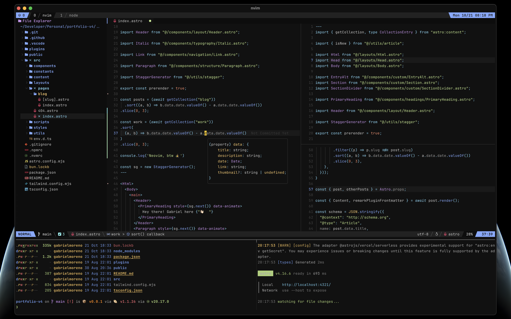

<p align="center">
  
</p>

# Gfiles

[](https://github.com/gantoreno/gfiles/issues)
[](https://github.com/gantoreno/gfiles/network/members)
[](https://github.com/gantoreno/gfiles/stargazers)
[](LICENSE.md)

My personal macOS dotfiles for a small, terminal-first development environment. The repository is intentionally focused on the configuration I actively use, with Git as the source of truth and symlinks connecting it to my home directory.



> [!NOTE]
>
> This is a personal setup, not a universal installer. It assumes macOS, Homebrew-style paths, and a clone at `~/Developer/gantoreno/gfiles`. Review the files before using them on another machine.

## Setup

- **Terminal:** [Ghostty](https://ghostty.org/) with Tokyo Night
- **Shell:** [Zsh](https://www.zsh.org/) with [Oh My Zsh](https://ohmyz.sh/) and the Robby Russell theme
- **Multiplexer:** [tmux](https://github.com/tmux/tmux) with [TPM](https://github.com/tmux-plugins/tpm), tmux-sensible, and [tmux-powerkit](https://github.com/gantoreno/tmux-powerkit)
- **Editor:** [Neovim](https://neovim.io/) with [LazyVim](https://www.lazyvim.org/), Tokyo Night, tmux navigation, and Sidekick
- **AI tooling:** [OpenCode](https://opencode.ai/) backed by a local [Ollama](https://ollama.com/) model

The shell configuration initializes `fnm`, `direnv`, and `zoxide`, and includes paths for the language and package tooling installed on my machine.

## Tracked configuration

| Source | Home location | Purpose |
| --- | --- | --- |
| `.zshenv` | `~/.zshenv` | Early shell environment and Cargo setup |
| `.zshrc` | `~/.zshrc` | Interactive shell, PATH, plugins, and aliases |
| `.oh-my-zsh` | `~/.oh-my-zsh` | Pinned Oh My Zsh submodule |
| `.tmux.conf` | `~/.tmux.conf` | tmux behavior, navigation, and theme |
| `.config/ghostty` | `~/.config/ghostty` | Terminal appearance and window defaults |
| `.config/nvim` | `~/.config/nvim` | LazyVim configuration and plugin lockfile |
| `.config/opencode` | `~/.config/opencode` | OpenCode provider, model, and MCP configuration |

## Installation

Clone the repository with its submodule:

```sh
git clone --recurse-submodules https://github.com/gantoreno/gfiles.git \
  "$HOME/Developer/gantoreno/gfiles"
```

Back up or remove any existing files at the destinations below, then create the symlinks:

```sh
GFILES="$HOME/Developer/gantoreno/gfiles"

mkdir -p "$HOME/.config"

ln -s "$GFILES/.zshenv" "$HOME/.zshenv"
ln -s "$GFILES/.zshrc" "$HOME/.zshrc"
ln -s "$GFILES/.oh-my-zsh" "$HOME/.oh-my-zsh"
ln -s "$GFILES/.tmux.conf" "$HOME/.tmux.conf"
ln -s "$GFILES/.config/ghostty" "$HOME/.config/ghostty"
ln -s "$GFILES/.config/nvim" "$HOME/.config/nvim"
ln -s "$GFILES/.config/opencode" "$HOME/.config/opencode"
```

Install the tmux plugins from inside tmux with `prefix + I`. LazyVim installs its plugins when Neovim starts.

The OpenCode configuration contains a machine-specific Pencil MCP executable path. Update or disable that entry before using the configuration elsewhere.

## License

Licensed under the [GNU GPLv3](LICENSE.md).
